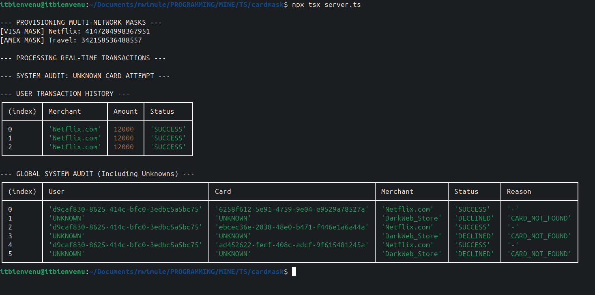

installation

``` git clone git@github.com:itbienvenu/cardmask.git ```

``` cd carddmask ```


install npm packages

``` npm install ```


the start command

``` npx tsx server.ts --watch ```

CURRENT STATUS


